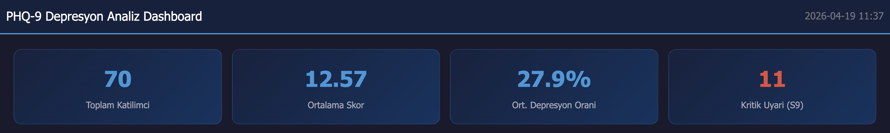
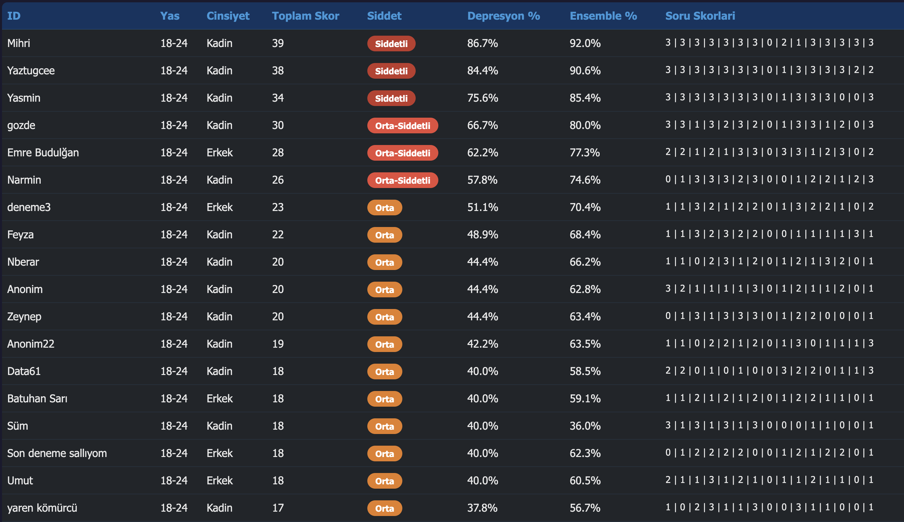
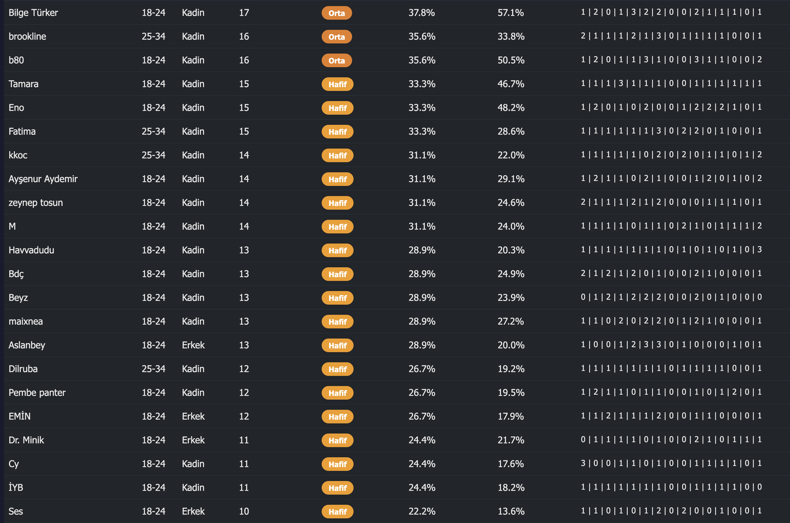
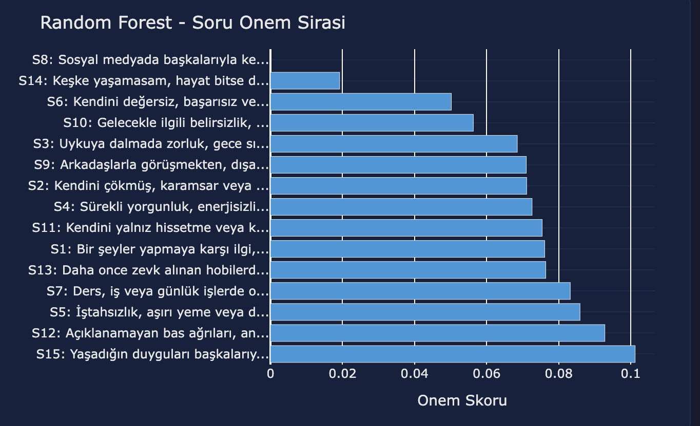
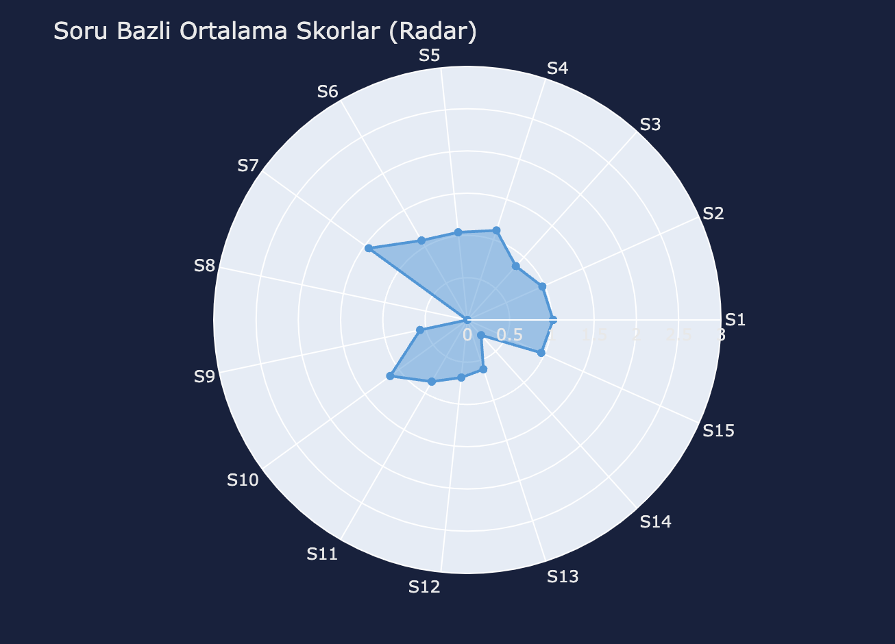

# PHQ-9 Depression Analysis System
19 April 2026 - Sunday


A comprehensive depression screening and analysis system built with Python. Collects responses via Google Forms using an extended 15-question PHQ-9 scale, performs clinical scoring, runs machine learning models, conducts statistical analysis, and generates automated reports with interactive dashboards.



## Features

- **Google Forms Integration** — Automatically creates and distributes the PHQ-9 questionnaire, fetches responses via API
- **Clinical PHQ-9 Scoring** — Total score calculation, severity classification, depression percentage, and critical question monitoring (self-harm ideation)
- **Machine Learning Models** — 6 algorithms (K-Means, Random Forest, Logistic Regression, SVM, Decision Tree, Naive Bayes) with ensemble prediction combining 60% clinical + 40% ML weight
- **Statistical Analysis** — Descriptive statistics, 95% confidence intervals, normality testing (Shapiro-Wilk), Pearson & Spearman correlation, gender-based comparison (t-test / Mann-Whitney U)
- **Automated Reporting** — Interactive HTML dashboard with Plotly, general summary PDF, individual participant PDF reports, and static chart generation




## Project Structure

```
depression_analysis_project/
├── main.py                     # CLI entry point
├── requirements.txt            # Dependencies
├── config/
│   ├── settings.py             # Central configuration & PHQ-9 constants
│   └── form_config.json        # Google Form metadata & question mapping
├── src/
│   ├── analysis/
│   │   ├── phq9_scorer.py      # Clinical PHQ-9 scoring engine
│   │   ├── ml_models.py        # ML model training & ensemble
│   │   └── statistical_analysis.py
│   ├── google_forms/
│   │   ├── form_creator.py     # Google Forms creation
│   │   └── response_fetcher.py # Response fetching & demo data
│   ├── reporting/
│   │   ├── pdf_report.py       # PDF report generation
│   │   ├── dashboard_generator.py
│   │   └── visualizations.py   # Plotly & Matplotlib charts
│   └── utils/
│       └── helpers.py
└── output/                     # Generated reports & charts
```




## Installation

```bash
git clone https://github.com/gorkemergune/depression-phq9-analysis-.git
cd depression-phq9-analysis-
pip install -r requirements.txt
```

### 1. Run Demo (no Google API required)

```bash
python3 main.py --demo
```

Generates 30 synthetic participants and runs the full analysis pipeline — scoring, ML models, statistics, dashboard, and PDF reports.

### 2. Create Google Form

```bash
python3 main.py --anket-olustur
```

Creates the PHQ-9 questionnaire on Google Forms and returns a shareable link.

### 3. Fetch Responses & Analyze

```bash
python3 main.py --sonuclar
```

Fetches responses from Google Forms API, runs the full analysis, and generates all reports.

### 4. Full Pipeline via Google Sheets

```bash
python3 main.py --full-pipeline SHEET_ID
```

Alternative method using a Google Sheets spreadsheet ID as the data source.

## Severity Classification

| Level | Score Range | Risk |
|-------|-----------|------|
| Minimal | 0–7 | 0–15% |
| Mild | 8–15 | 20–40% |
| Moderate | 16–23 | 40–60% |
| Moderate-Severe | 24–33 | 60–80% |
| Severe | 34–45 | 80–100% |

Scoring is based on a 15-question extended PHQ-9 scale (max score: 45). Question 14 is flagged as a critical question for self-harm ideation monitoring.

## ML Models & Performance

| Model | Description |
|-------|-------------|
| K-Means Clustering | Groups participants into depression profiles |
| Random Forest | Feature importance & multi-class classification |
| Logistic Regression | Binary classification with probability scores |
| SVM | Multi-class severity classification |
| Decision Tree | Interpretable decision rules |
| Gaussian Naive Bayes | Probabilistic classification |
| **Ensemble** | **Weighted combination (60% clinical, 40% ML)** |

Cross-validation is performed with stratified 5-fold splits. The system is optimized for pilot study sample sizes (10–50+ participants).

## Output

| Output | Format | Description |
|--------|--------|-------------|
| Interactive Dashboard | HTML | Dark-themed Plotly dashboard with 10+ visualizations |
| General Summary Report | PDF | Aggregate statistics, model results, severity distribution |
| Individual Reports | PDF | Per-participant score breakdown, ML predictions, risk assessment |
| Static Charts | PNG | Correlation heatmap, severity pie, model comparison, and more |


## License

This project is for educational and research purposes.
